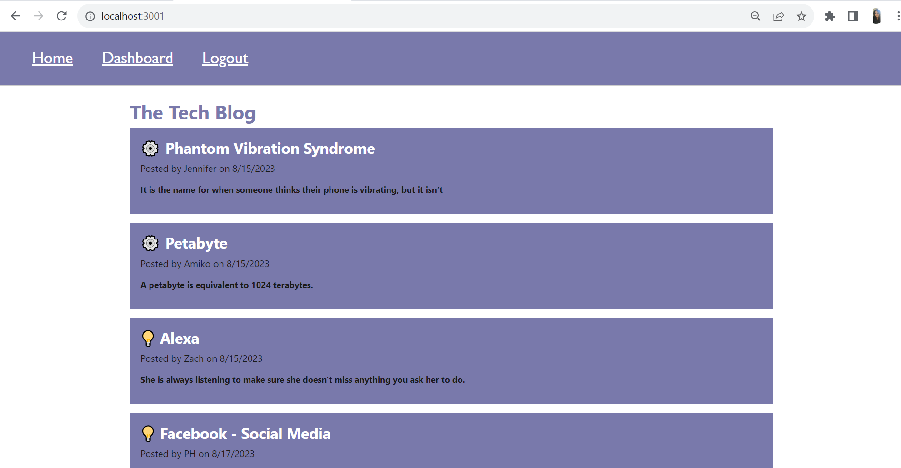

# MVCTechBlog
Challenge 14 - Model-View-Controller (MVC) Challenge: Tech Blog

This project uses the following:
HTML,
CSS,
JavaScript,
node modules,
express-handlebars,
MySQL2,
Sequelize,
dotenv,
bcrypt package to hash passwords,
express-session (stores the session data),
connect-session-sequelize

The project includes the following files
.eslintignore
.eslintrc.json
.gitignore
LICENSE
README.md
config/connection.js
controllers/api/blogRoutes.js
controllers/api/commentRoutes.js
controllers/api/index.js
controllers/api/userRoutes.js
controllers/homeRoutes.js
controllers/index.js
db/schema.sql
models/Blog.js
models/Comment.js
models/User.js
models/index.js
package-lock.json
package.json
public/css/jass.css
public/css/style.css
public/js/comment.js
public/js/dashboard.js
public/js/login.js
public/js/logout.js
seeds/blogData.json
seeds/commentData.json
seeds/seed.js
seeds/userData.json
server.js
utils/auth.js
utils/helpers.js
views/blog.handlebars
views/dashboard.handlebars
views/homepage.handlebars
views/layouts/main.handlebars
views/login.handlebars

This is project keeps Technology Blogs and allows the user to Create a Blog, add comments to an existing Blog, delete their blog and delete their comments.
When a user goes to the Tech Blog website, they see 2 menus, Home and Login.  
When the user is in the Homepage, the user sees all existing Blogs, its title and blog entry with the blog's user name and date the blog was entered.
In the homepage, the user can click on an existing Blog to see details of the Blog. The user cannot add comments to a Blog unless the user logs in.
When the user goes to Log in, the user can Log in using their existing profile info or Signup to create a user profile.
Once logged in, their credentials are saved and a session id tracks their user id and allows them signed in for a specific amount of time.  The website will time out when the session expires and the user will need to log in again.
Once logged in, the user can select the Logout link to logout.
Once logged in, a Dashboard link will show in the navigation and the user is brought to this page.
In the Dashboard link, a list of blogs created by the user will be shown and the user has an option to create a new Blog.
The user can delete an existing Blog from the Dashboard page.
Once a user creates a new Blog, the page will refresh adding the latest Blog to the end of the list of Blogs created by the user.
The user can click on an existing Blog which will bring them to a details page where the user can add comments or delete an existing comment.
When a user logs out, the user gets verification that they have signed out.

The mini project code for lesson 28 was used as the starter code.

To run this site you must do the following in your terminal first:
Seed the database:
log into mysql
mysql -u root -p 
enter your mysql password
exit mysql by entering bye;
SOURCE db/seeds.js
Once the techblog_db database has been seeded, you can run server.js from the terminal then open your web browser and enter localhost:3001

GitHub repository link:
https://github.com/agentpj/MVCTechBlog

GitHub deployed link:
https://agentpj.github.io/MVCTechBlog/

Screenshot of deployed project:

